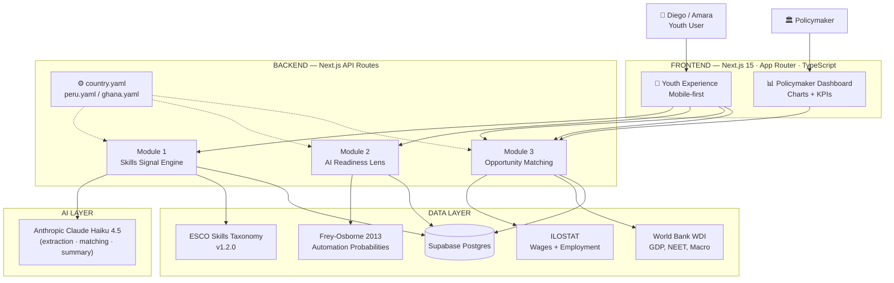

# 🌍 UNMAPPED

> **Open infrastructure that maps a young person's real, informal skills to real economic opportunities — in any low- and middle-income country.**

Built solo for **Hack-Nation × MIT × World Bank · Youth Summit 2026** · Challenge 5: *Unmapped*.

[](https://nextjs.org/)
[](https://www.typescriptlang.org/)
[](https://www.anthropic.com/)
[](https://opensource.org/licenses/MIT)

---

## The problem

Over **600 million** young people in low- and middle-income countries hold real, unrecognized skills — learned in family businesses, on YouTube, in informal apprenticeships. Education credentials don't translate to the labor market. AI is redrawing the skills landscape faster than institutions can track. And matching infrastructure simply does not exist outside formal economies.

**Meet Diego (21, Cusco, Peru)** — repairs motorcycles in his uncle's shop, sells parts on Facebook, taught himself Excel from YouTube to track inventory.
**Meet Amara (22, Accra, Ghana)** — runs a phone repair business, taught herself Python on YouTube, speaks three languages.

Today, neither of them is visible to the formal economy.

---

## What UNMAPPED does

Three modules behind a single API, exposed through a dual interface (youth user + policymaker dashboard):

### 🧬 Module 1 — Skills Signal Engine
Free-text self-description in any language → ESCO-tagged, ISCO-mapped, portable skills profile + a human-readable summary the user can show employers.

### 🛡️ Module 2 — AI Readiness Lens
Calibrated automation risk for the **local** economy (not the U.S. baseline) using Frey-Osborne probabilities × country-specific multipliers. Identifies durable skills, at-risk skills, and 3 specific resilient adjacent skills to learn next.

### 📊 Module 3 — Opportunity Matching
Real ILOSTAT wage data + World Bank WDI growth rates, scored by `0.4·skill_match + 0.3·wage + 0.3·growth`. Each opportunity card surfaces the actual numbers — not buried, but *visible*.

### ⚙️ Country Configuration
Switch the entire app — language, currency, automation calibration, data sources, demo persona — between Peru and Ghana via a single YAML file. **No redeploy. No code change.** Any government can fork this repo and add their country today.

---

## Architecture



---

## Real data sources

This project uses real public data — **no synthetic proxies**. Every number you see in the UI traces back to a source:

| Dataset | Use | Citation |
|---|---|---|
| **ESCO Skills Taxonomy v1.2.0** | Module 1 — skill matching | European Commission |
| **Frey & Osborne 2013** | Module 2 — automation probabilities | Oxford Martin School |
| **ILOSTAT** | Module 3 — wages, employment by sector | International Labour Organization |
| **World Bank WDI** | Module 3 — GDP, NEET rates, labor force | World Bank Open Data |
| **ISCO-08** | Standardized occupation codes | International Labour Organization |

Cached subset shipped in `data/`:
- `esco_skills_subset.csv` — 50 skills relevant to Peru/Ghana labor markets
- `frey_osborne_isco.csv` — 160 ISCO occupations with automation scores
- `ilo_wages_{peru,ghana}.json` — median monthly wages by ISCO (local + USD)
- `ilo_employment_{peru,ghana}.json` — sector employment 2022–2024 with growth %
- `wdi_{peru,ghana}.json` — GDP per capita, NEET, labor force, internet access

---

## Tech stack

| Layer | Choice | Why |
|---|---|---|
| Framework | Next.js 15 (App Router, TypeScript) | One language, one deploy, server actions ready |
| Styling | Tailwind CSS 4 + shadcn/ui | Fast iteration, dark theme |
| Backend | Next.js API Routes | No separate server needed |
| Database | Supabase (PostgreSQL) | Free tier, 5-min setup |
| LLM | Anthropic **Claude Haiku 4.5** | Fast, cheap, no vector DB needed |
| Charts | Recharts | React-native, accessible |
| i18n | next-intl + YAML configs | Per-country localizability |
| Deploy | Vercel | Push-to-deploy |

**Why no embeddings?** Pure Claude-based skill matching with a keyword pre-filter eliminates the need for a separate vector database. Trade-off: slightly slower first match, but one fewer external dependency = fewer failure points during a live demo.

---

## Country Configuration

Configure any country with a single YAML file:

```yaml
# config/countries/peru.yaml
country_code: PER
country_name: Peru
primary_language: es
currency: PEN
isco_version: ISCO-08
automation_calibration:
  manual_routine: 0.7      # less automatable in low-infra context
  cognitive_routine: 0.85
  manual_nonroutine: 0.95  # mostly safe
data_sources:
  wages: ilo_wages_peru.json
  employment: ilo_employment_peru.json
  macro: wdi_peru.json
informal_economy_share: 0.75
youth_neet_rate: 0.18
demo_persona:
  name: Diego
  age: 21
  region: Cusco
  description_es: "Reparo motocicletas en el taller de mi tío..."
```

The repo ships with **Peru** and **Ghana**. To add another country, drop a new YAML in `config/countries/`, register it in `src/lib/config-loader.ts`, and provide cached ILO/WDI data files.

---

## Run locally

### Prerequisites
- Node.js 20+ (we built on v22)
- Supabase free account
- Anthropic API key

### 1. Clone & install
```bash
git clone https://github.com/arkhangio10/unmapped
cd unmapped
npm install
```

### 2. Set up Supabase
1. Create a new Supabase project at https://supabase.com
2. In the SQL Editor, run the schema from `supabase/schema.sql` (or paste from this README's appendix)
3. Disable RLS on the 5 tables (hackathon shortcut — service role key bypasses it anyway)
4. Copy your **Project URL**, **anon key**, and **service role key**

### 3. Environment variables
Create `.env.local`:
```env
ANTHROPIC_API_KEY=sk-ant-...
NEXT_PUBLIC_SUPABASE_URL=https://xxxxx.supabase.co
NEXT_PUBLIC_SUPABASE_ANON_KEY=eyJ...
SUPABASE_SERVICE_ROLE_KEY=eyJ...
ACTIVE_COUNTRY=PER
```

### 4. Run
```bash
npm run dev
```
Open http://localhost:3000 → click **Try the demo** → click **Use demo persona (Diego, Cusco)** → watch UNMAPPED do its thing.

To switch to Ghana: top-right country chip → **Switch to Ghana 🇬🇭**.

---

## Demo flow

1. **`/`** — landing page
2. **`/onboarding`** — single textarea for free-text self-description, dropdowns for demographics, multi-select for languages
3. **`/profile/[id]`** — generated skills profile with employer-ready summary at the top + ESCO-tagged skill grid
4. **`/profile/[id]/risk`** — circular automation-risk gauge calibrated for the active country, durable vs at-risk skill columns, 3 recommended adjacent skills with rationale
5. **`/profile/[id]/match`** — 3–5 opportunity cards with **real wages in local currency + USD**, sector growth, reachability badge
6. **`/dashboard`** — policymaker view: GDP/NEET/informal-share KPIs, sector growth bars, automation-exposure pie chart
7. **`/admin/config`** — the killer demo: switch active country in <2 seconds, watch the entire app reconfigure

---

## API surface

All endpoints under `/api/v1/`:

| Method | Endpoint | Purpose |
|---|---|---|
| `POST` | `/api/v1/profile/create` | Run Module 1 (skills extraction) |
| `GET` | `/api/v1/profile/[id]` | Fetch full profile |
| `POST` | `/api/v1/risk/assess` | Run Module 2 (automation risk) |
| `POST` | `/api/v1/opportunities/match` | Run Module 3 (opportunity matching) |
| `GET` | `/api/v1/dashboard/aggregate?country_code=` | Aggregate signals for policymaker view |
| `GET` | `/api/v1/config/[country_code]` | Fetch country config |
| `POST` | `/api/v1/config/switch` | Switch active country (sets cookie) |
| `GET` | `/api/v1/debug` | Connection diagnostics |

---

## License

MIT — fork it, ship it, configure it for your country.

## Built by

Solo Peruvian developer who has lived inside the informal-economy gap this tool addresses. UNMAPPED is designed as **open infrastructure governments and NGOs can fork** — not a product to compete with them.
